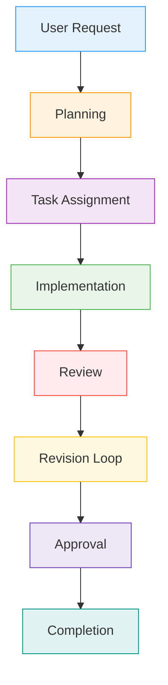
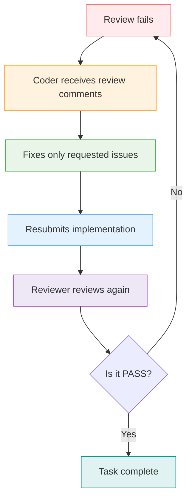
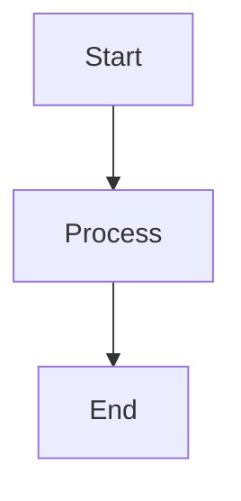

# Agent Communication Protocol

## Overview

This document defines the communication protocol for the autonomous multi-agent software engineering team building the DevAtlas platform. This protocol serves as the single source of truth for all agent interactions and ensures deterministic, stateless execution across the entire development lifecycle.

## Overall Philosophy

### Core Principles

- **Single Source of Truth**: All communication flows through the defined protocol channels
- **One Task at a Time**: Agents work on one task simultaneously to prevent conflicts and ensure focus
- **No Agent Edits Another Agent's Responsibilities**: Each agent has clearly defined boundaries and responsibilities
- **Deterministic Communication**: All interactions follow predictable patterns and formats
- **Stateless Execution Where Possible**: Agents maintain minimal state and rely on task packages for context

## Agent Responsibilities

### Orchestrator

**Responsibilities:**
- Task planning and prioritization
- Breaking down user requests into actionable tasks
- Assigning tasks to appropriate agents
- Tracking task progress and status
- Coordinating between agents when needed
- Final approval of completed work

**What Orchestrator MUST NOT Do:**
- Directly implement code or modify files
- Review code quality or architecture
- Make technical decisions about implementation
- Write documentation or tests

### Coder

**Responsibilities:**
- Implementing tasks according to specifications
- Writing clean, efficient, and maintainable code
- Adding comprehensive tests
- Updating documentation
- Following coding standards and best practices
- Making technical implementation decisions within scope

**What Coder MUST NOT Do:**
- Plan overall project strategy
- Review other agents' work
- Make decisions about task prioritization
- Modify tasks assigned by Orchestrator

### Reviewer

**Responsibilities:**
- Evaluating implementation quality
- Ensuring architectural soundness
- Checking security and performance implications
- Validating test coverage and documentation
- Providing constructive feedback
- Approving or requesting changes to work

**What Reviewer MUST NOT Do:**
- Implement code or make technical changes
- Plan tasks or assign work
- Override decisions made by other agents
- Directly communicate with end users

## Communication Flow



## Task Package

The Orchestrator sends the following package to the Coder:

| Field | Type | Required | Description |
|-------|------|----------|-------------|
| `taskId` | string | Yes | Unique identifier for the task |
| `goal` | string | Yes | Clear, measurable objective |
| `context` | object | Yes | Background information and constraints |
| `files` | array | Yes | List of files to be modified/created |
| `constraints` | object | No | Technical or business constraints |
| `acceptanceCriteria` | array | Yes | Specific conditions for success |
| `dependencies` | array | No | Other tasks or resources required |
| `priority` | string | Yes | Urgency level (high/medium/low) |

### Example Task Package

```json
{
  "taskId": "feat-001",
  "goal": "Implement user authentication system",
  "context": {
    "project": "DevAtlas",
    "existingAuth": false,
    "techStack": ["FastAPI", "PostgreSQL"]
  },
  "files": [
    "src/auth/__init__.py",
    "src/auth/models.py",
    "src/auth/routes.py",
    "tests/test_auth.py"
  ],
  "constraints": {
    "securityStandards": ["OWASP A01", "OWASP A02"],
    "performanceTarget": "<100ms response time"
  },
  "acceptanceCriteria": [
    "Users can register with email/password",
    "JWT tokens are issued and validated",
    "Password hashing uses bcrypt",
    "API endpoints are properly secured"
  ],
  "dependencies": ["feat-002"],
  "priority": "high"
}
```

## Implementation Report

The Coder returns the following report:

| Field | Type | Description |
|-------|------|-------------|
| `summary` | string | Brief overview of work completed |
| `filesModified` | array | List of files changed/created |
| `decisionsMade` | array | Key technical decisions and rationale |
| `assumptions` | array | Assumptions made during implementation |
| `risks` | array | Potential risks and mitigation strategies |
| `testsAdded` | array | Tests created or modified |
| `remainingWork` | array | Incomplete items or next steps |

### Example Implementation Report

```json
{
  "summary": "Implemented user authentication with JWT tokens and bcrypt password hashing",
  "filesModified": [
    "src/auth/models.py",
    "src/auth/routes.py",
    "src/auth/utils.py"
  ],
  "decisionsMade": [
    "Used JWT for stateless authentication",
    "Implemented bcrypt with salt rounds=12",
    "Added rate limiting to prevent brute force"
  ],
  "assumptions": [
    "Email domain validation will be handled separately",
    "Two-factor authentication is out of scope"
  ],
  "risks": [
    "Token theft if keys are compromised",
    "Performance impact of bcrypt hashing"
  ],
  "testsAdded": [
    "test_auth_registration.py",
    "test_auth_login.py",
    "test_auth_token_validation.py"
  ],
  "remainingWork": [
    "Add password reset functionality",
    "Implement session management"
  ]
}
```

## Review Report

The Reviewer returns one of the following states:

### PASS

```json
{
  "state": "PASS",
  "score": 100,
  "feedback": "All requirements met. Implementation is clean, secure, and well-tested."
}
```

### CHANGES_REQUESTED

```json
{
  "state": "CHANGES_REQUESTED",
  "issues": [
    {
      "category": "Architecture",
      "severity": "high",
      "description": "Database schema design needs normalization",
      "location": "src/models/user.py",
      "suggestion": "Split user data into separate tables"
    }
  ],
  "feedback": "Implementation needs architectural improvements."
}
```

### BLOCKED

```json
{
  "state": "BLOCKED",
  "reason": "Missing dependencies required for implementation",
  "blockingItems": [
    "Database connection string",
    "API keys for external services"
  ],
  "estimatedUnblockTime": "2024-01-15"
}
```

Each review must include evaluation across these dimensions:

- **Architecture**: Design patterns, modularity, scalability
- **Correctness**: Functionality, edge cases, error handling
- **Security**: Vulnerabilities, best practices, compliance
- **Performance**: Efficiency, resource usage, optimization
- **Testing**: Coverage, test quality, test automation
- **Documentation**: Code comments, API docs, user guides

## Retry Loop

When a review fails, the following process occurs:



### Retry Guidelines

1. **Scope Limitation**: Coder only addresses issues mentioned in the review
2. **No Regressions**: Existing functionality must continue to work
3. **Documentation Updates**: Any documentation must be updated accordingly
4. **Testing**: New or modified tests must cover the changes
5. **Code Quality**: Changes must maintain existing code standards

## Completion Rules

A task is complete only when ALL of the following conditions are met:

- ✅ **Acceptance Criteria Met**: All specified requirements are fulfilled
- ✅ **Review Passed**: Reviewer has approved the implementation
- ✅ **Tests Pass**: All existing and new tests pass
- ✅ **Documentation Updated**: All relevant documentation is current
- ✅ **No Unresolved Blockers**: All issues have been addressed

### Completion Checklist

```markdown
- [ ] Acceptance criteria verified
- [ ] Code review completed and approved
- [ ] All tests passing (100% coverage where applicable)
- [ ] Documentation updated
- [ ] Dependencies updated
- [ ] Performance benchmarks met
- [ ] Security review completed
- [ ] No open issues or blockers
```

## Future Extensibility

The protocol is designed to support additional agents without requiring changes to existing communication rules:

### Adding New Agents

1. **Define Responsibilities**: Clearly specify what the new agent does and doesn't do
2. **Update Orchestrator**: Add logic for when to use the new agent
3. **Define Communication**: Specify how the new agent interacts with existing ones
4. **Maintain Boundaries**: Ensure the new agent doesn't overlap with existing responsibilities

### Example: Adding a FastAPI Specialist

```json
{
  "agent": "FastAPISpecialist",
  "responsibilities": {
    "implements": ["FastAPI endpoints", "API documentation"],
    "doesNotImplement": ["Business logic", "Database operations"]
  },
  "communication": {
    "receivesFrom": ["Orchestrator"],
    "sendsTo": ["Coder", "Reviewer"],
    "taskTypes": ["api", "endpoint", "documentation"]
  }
}
```

## Formatting Guidelines

This document follows these formatting standards:

### Markdown Usage

- Use **bold** for emphasis
- Use *italics* for technical terms
- Use `code` for inline code snippets
- Use ```code blocks``` for multi-line code

### Tables

Use GitHub-flavored markdown tables for structured data.

### Flowcharts

Use Mermaid for diagrams:



### Callout Sections

Use `> **Note:**` for important information.

### Examples

Provide concrete examples to illustrate concepts.

## Conclusion

This protocol serves as the foundation for our autonomous multi-agent development process. By following these guidelines, we ensure consistent, reliable, and scalable development across the DevAtlas platform. Every future AI agent will rely on this protocol as the canonical communication specification.

The protocol is living documentation that will evolve as our team grows and our processes mature. Regular reviews of this document are recommended to ensure it remains relevant and effective.