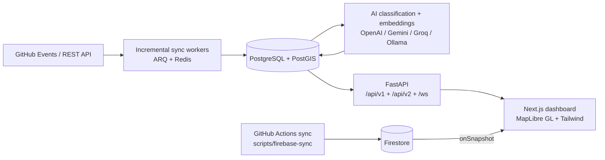

# DevAtlas

AI-powered developer-ecosystem intelligence: it ingests public GitHub activity, classifies and geocodes repositories, and serves an interactive geospatial dashboard.

[](https://github.com/aditya0si/DevAtlas/actions/workflows/ci.yml)

## Overview

DevAtlas collects public GitHub repository and event data, enriches it with AI-based domain classification, embeddings, and location intelligence, and exposes it through a FastAPI service and a Next.js + MapLibre dashboard. The repository contains two data paths that share the same frontend surface:

- A **FastAPI + PostgreSQL/PostGIS** backend with workers for incremental sync, classification, embeddings, activity/ecosystem scoring, and analytics.
- A **Firebase path** where a GitHub Actions worker writes enriched documents to Firestore and the dashboard subscribes with `onSnapshot` for realtime map updates.

## Architecture



- **Ingestion (backend):** GitHub API clients feed incremental sync workers scheduled through ARQ/Redis.
- **Storage:** PostgreSQL with PostGIS for geospatial queries and pgvector for embeddings.
- **Enrichment:** AI providers classify repository domains and generate embeddings; Nominatim geocodes developer locations.
- **Serving:** FastAPI routers expose ecosystem, geospatial, activity, analytics, and sync endpoints.
- **Frontend:** Next.js renders a MapLibre GL heatmap/point map plus analytics and AI panels.
- **Realtime (Firebase):** `functions/src/index.js` is a read-only Cloud Function over Firestore; `frontend/src/lib/useRealtimeRepos.ts` subscribes to repository documents.

## Key Features

- Interactive MapLibre map with heatmap, glow, and point layers colored by classified domain.
- AI repository classification across domains (AI/ML, cybersecurity, healthcare, robotics, web, mobile, DevOps, blockchain, open source).
- Semantic search over repository embeddings and an "Ask DevAtlas" copilot with grounded repository context.
- Trend explanation and state/ecosystem comparison endpoints.
- India ecosystem statistics, state dashboards, discovery feeds, and ecosystem scores.
- Activity intelligence: push-event enrichment, daily/hourly aggregations, activity and ecosystem scores, data-quality metrics.
- JWT authentication with rotating refresh tokens and email verification.
- Observability: structured logging, Prometheus metrics, deep health checks, metrics summaries.
- v2 API with cursor-based pagination and deprecated v1 endpoints.

## Tech Stack

| Layer | Technology |
|---|---|
| Backend | Python 3.11, FastAPI, SQLAlchemy 2 (async), Alembic, Pydantic v2 |
| Database | PostgreSQL + PostGIS, pgvector |
| Cache / Queue | Redis, ARQ workers |
| AI | OpenAI, Google Gemini, Groq, Ollama (provider fallback chain) |
| Frontend | Next.js 15, React 18, TypeScript, Tailwind CSS, MapLibre GL, Framer Motion, Zustand |
| Frontend data | Firebase Firestore (browser client), read-only Cloud Function |
| Sync worker | Node.js script under `scripts/firebase-sync`, run by GitHub Actions |
| CI | GitHub Actions (`.github/workflows/ci.yml`) |

## Quickstart

### Backend

Requires Python 3.11+ and a reachable PostgreSQL/PostGIS instance (Redis is optional; rate limiting degrades without it).

```bash
cd backend
python -m venv .venv
# Windows: .venv\Scripts\activate
source .venv/bin/activate
pip install -r requirements.txt
alembic upgrade head
uvicorn app.main:app --reload
```

Alternative with [uv](https://github.com/astral-sh/uv) (as used in CI):

```bash
cd backend
uv venv
uv pip install -r requirements.txt
uvicorn app.main:app --reload
```

The API is served under `API_PREFIX` (default `/api/v1`); the OpenAPI UI is available at `/docs`.

### Frontend

Requires Node.js 20+.

```bash
cd frontend
npm install
npm run dev
```

The frontend reads its Firebase and API settings from environment variables (see below). For a static export / Firebase Hosting build:

```bash
cd frontend
npm run build
```

### Dependencies

There is no `docker-compose.yml` in this repository. Provide PostgreSQL with the PostGIS extension yourself (and Redis if you want rate limiting and background jobs); set `DATABASE_URL` (and optionally `REDIS_URL`) accordingly.

## Environment Variables

No values are stored in the repository. Names and purpose:

### Backend

| Variable | Purpose |
|---|---|
| `DATABASE_URL` | Async SQLAlchemy database URL (PostgreSQL/PostGIS) |
| `REDIS_URL` | Redis URL for caching, rate limiting, and ARQ workers |
| `GITHUB_TOKEN` | GitHub personal access token for API ingestion |
| `GITHUB_APP_ID` | GitHub App ID (alternative to a PAT) |
| `GITHUB_APP_PRIVATE_KEY_PATH` | Path to the GitHub App private key |
| `GITHUB_APP_INSTALLATION_ID` | GitHub App installation ID |
| `OPENAI_API_KEY` | OpenAI key for embeddings/classification |
| `GEMINI_API_KEY` | Google Gemini key (AI provider) |
| `GROQ_API_KEY` | Groq key (AI provider) |
| `GROQ_MODEL` | Groq model name |
| `OLLAMA_BASE_URL` | Base URL of an Ollama server |
| `OLLAMA_MODEL` | Ollama chat model |
| `OLLAMA_EMBEDDING_MODEL` | Ollama embedding model |
| `OLLAMA_EMBEDDING_DIMENSIONS` | Embedding dimensions for Ollama |
| `LOCATION_MIN_CONFIDENCE` | Minimum geocoding confidence to accept |
| `GEOCODE_RATE_LIMIT_SECONDS` | Delay between geocoding requests |
| `GEOCODING_USER_AGENT` | User-Agent sent to the geocoder |
| `EMBEDDING_MODEL` | Embedding model name |
| `EMBEDDING_DIMENSIONS` | Embedding vector dimensions |
| `JWT_SECRET_KEY` | Secret used to sign JWTs (must be changed in production) |
| `JWT_ALGORITHM` | JWT signing algorithm |
| `ACCESS_TOKEN_EXPIRE_MINUTES` | Access-token lifetime |
| `REFRESH_TOKEN_EXPIRE_MINUTES` | Refresh-token lifetime |
| `RATE_LIMIT_REQUESTS` | Requests allowed per rate-limit window |
| `RATE_LIMIT_WINDOW_SECONDS` | Rate-limit window length |
| `CORS_ORIGINS` | Comma-separated allowed browser origins |
| `FRONTEND_URL` | Frontend base URL used in emails/links |
| `EMAIL_SERVICE` | Email transport (`console` or `smtp`) |
| `SMTP_HOST` / `SMTP_PORT` | SMTP server and port |
| `SMTP_USERNAME` / `SMTP_PASSWORD` | SMTP credentials |
| `SMTP_USE_TLS` / `SMTP_FROM_ADDRESS` | SMTP TLS toggle and sender address |
| `APP_NAME` / `ENVIRONMENT` / `API_PREFIX` | Service name, environment, and API route prefix |
| `TEST_DATABASE_URL` | Database used by the test suite |

### Frontend

| Variable | Purpose |
|---|---|
| `NEXT_PUBLIC_API_URL` | Base URL for API calls (empty uses same-origin `/api/v1`) |
| `NEXT_PUBLIC_FIREBASE_API_KEY` | Firebase web API key |
| `NEXT_PUBLIC_FIREBASE_AUTH_DOMAIN` | Firebase auth domain |
| `NEXT_PUBLIC_FIREBASE_PROJECT_ID` | Firebase project ID |
| `NEXT_PUBLIC_FIREBASE_STORAGE_BUCKET` | Firebase storage bucket |
| `NEXT_PUBLIC_FIREBASE_MESSAGING_SENDER_ID` | Firebase messaging sender ID |
| `NEXT_PUBLIC_FIREBASE_APP_ID` | Firebase app ID |

### Firebase sync workflow

`.github/workflows/sync-github-india.yml` runs `scripts/firebase-sync/sync.js`; it expects these GitHub Actions secrets: `GIT_TOKEN`, `GEMINI_API_KEY`, `FIREBASE_SERVICE_ACCOUNT`.

## API Surface

Base prefix is `API_PREFIX` (default `/api/v1`). Routers included by `backend/app/api/routes.py`:

| Router | Prefix | Example endpoints |
|---|---|---|
| Health | `/health` | `GET /health/health` |
| Auth | `/auth` | `POST /register`, `POST /token`, `POST /refresh`, `GET /verify-email`, `POST /resend-verification`, `GET /me` |
| Repositories | `/repositories` | `GET /`, `GET /{repository_id}` |
| Events | `/events` | `GET /` |
| Geospatial | `/geospatial` | `GET /activity` |
| Sync | `/sync` | `POST /sync/full`, `/sync/incremental`, `/sync/enrich-users`, `/sync/classify`, `/sync/analytics`, `/sync/pipeline`, `/sync/events`, `/sync/enrich-events`, `/sync/scores`, `/sync/ecosystem-scores`, `/sync/aggregation`, `/sync/cache/invalidate`, `GET /sync/status/{job_id}` |
| India | `/india` | `GET /stats`, `/insights`, `/insights/summary`, `/overview`, `/states/{state}`, `/seed-status`, `/analytics/graphs`, `/scores`, `/discovery`, `/repositories/{repository_id}/card`, `/compare`, `/compare/insights`, `/ask/stream`; `POST /search/semantic`, `/trends/explain`, `/ask` |
| Location Intelligence | `/location-intelligence` | `POST /enrich/{login}` |
| Analytics | `/analytics` | `GET /snapshots`, `GET /snapshots/latest` |
| Observability | `/observability` | `GET /health/deep`, `GET /metrics/summary` |
| Activity | (root) | `GET /heatmap`, `/scores/states`, `/scores/cities`, `/ecosystem/scores`, `/domains/stats`, `/languages/stats`, `/daily`, `/monthly`, `/growth`, `/coverage`, `/layers`; `POST /admin/trigger/*` |
| v2 | `/v2` | `GET /v2/repositories`, `/v2/repositories/{repository_id}`, `/v2/events`, `/v2/health` |

Also exposed: WebSocket routes under `/ws` and Prometheus metrics at `/metrics`.

## Data Pipeline

1. **Ingest** — `GitHubAPIClient` fetches repositories and public events; incremental sync tracks the last processed id/ETag in `sync_state`.
2. **Store** — repositories, events, users, and aggregations are persisted in PostgreSQL with PostGIS geometry and pgvector embeddings.
3. **Enrich** — the AI provider fallback chain classifies repository domains; embeddings are generated for semantic search; location intelligence normalizes and geocodes developer locations into coordinates.
4. **Aggregate** — workers compute activity/ecosystem scores, daily/hourly aggregations, analytics snapshots, and data-quality metrics.
5. **Serve** — FastAPI routers expose the enriched data; the Next.js dashboard renders it on MapLibre maps and analytics views.
6. **Realtime (Firebase path)** — a scheduled GitHub Action discovers developers and repositories, classifies with Gemini, geocodes with Nominatim, and writes to Firestore; the browser subscribes via `onSnapshot` so the map updates without polling.

## Testing

Backend (from `backend/`):

```bash
ruff check .
pytest -q
```

Frontend (from `frontend/`):

```bash
npm run lint
npm test -- --ci --watchAll=false
npm run build
```

CI runs the backend suite against a `postgis/postgis:16-3.4` service container; database-backed tests require a reachable PostgreSQL/PostGIS instance. See `.github/workflows/ci.yml`.

## Deployment

Configuration present in the repository:

- **Backend:** `backend/Dockerfile` plus `railway.json` (Railway builds the backend Dockerfile; `watchPatterns` on `backend/**/*.py`).
- **Frontend:** `next.config.js` sets `output: 'export'` for static export, and the root `vercel.json` adds static-asset caching and security headers. `firebase.json` serves the static export (`frontend/out`) on Firebase Hosting.
- **Firebase:** `.firebaserc` points at the `gitlatitude` project; `firebase.json` configures Hosting, Firestore rules/indexes, and emulators; `functions/` contains a read-only `api` Cloud Function.
- **Sync:** `.github/workflows/sync-github-india.yml` runs the Firestore sync script on a schedule.

No live URLs, uptime, or traffic metrics are claimed here. Refer to `DEPLOYMENT.md` and `DEPLOYMENT_FIREBASE.md` for step-by-step notes.

## Documentation

See `docs/` for architecture notes (`architecture.md`, `architecture-sprint10.md`, `api-sprint10.md`).
