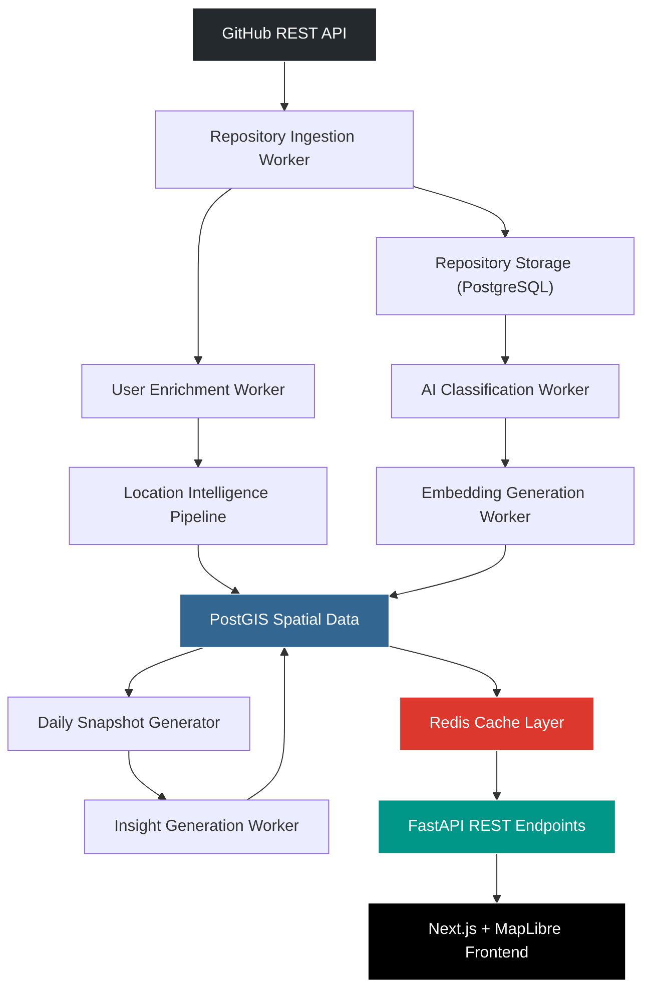

# Architecture — Sprint 10

## Real-Time GitHub Intelligence Pipeline

DevAtlas transforms from a static mock-data visualization into a live intelligence engine using an event-driven, decoupled worker pipeline.

### High-Level Flow

### Component Details

1. **Repository Ingestion**
   - Bootstraps repositories matching criteria (e.g. `location:India`).
   - Uses `github_id` for UPSERT deduplication.
   - Saves cursors in `SyncState` for resumability.

2. **User Enrichment**
   - Hydrates `GitHubUser` profiles with bio, company, followers, etc.
   - Pushes raw locations to the **Location Intelligence Pipeline** (OSM/Nominatim) for geocoding and postGIS `geom` insertion.

3. **Incremental Sync**
   - Polls high-activity repositories for changes using ETags (HTTP 304).
   - Refreshes stale user profiles automatically.

4. **AI Pipeline (Classification & Embedding)**
   - **Classifier**: GPT-4o assigns domains, maturity, and health metrics to new repositories.
   - **Embedder**: `text-embedding-3-small` generates pgvector embeddings for semantic search.
   - Both are batched and skip previously processed items unless `updated_at` > `classification_updated_at`.

5. **Analytics & Insights**
   - Materializes deep aggregations into `AnalyticsSnapshot` daily.
   - Passes snapshots to `InsightService` to generate LLM-powered macro insights.

### Worker Orchestration
Managed by `arq` running over Redis with scheduled cron definitions in `WorkerSettings`.

### Observability
- Deep health endpoint: `/api/v1/observability/health/deep`
- Metrics summary: `/api/v1/observability/metrics/summary`
